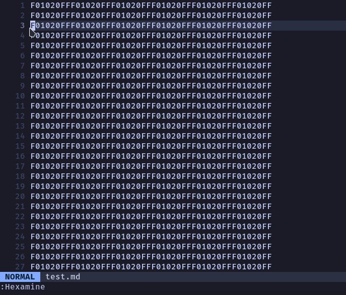

# 🧐 hexamine.nvim

Hexamine is a Neovim plugin that provides a dynamic floating window for displaying and converting
hexadecimal data under the cursor. It features dynamic resizing, automatic repositioning based on
cursor movement, and various data type conversions.

## Demo



## Installation

You can install Hexamine using your favorite package manager.

With Lazy, use:

```lua
{
    "vetsE/hexamine.nvim",
    config = function()
        config = {}
        require("hexamine").setup(config)
    end
}
```

## Configuration

Hexamine has a few configuration keys you can use. 

The default configuration is:

```lua
config = {
    keymap = {
        close = "<Esc>", -- Default key for closing the floating window
    },
    highlights = { "Normal", "Search" }, -- Highlights used for alternating rows
}
```

In particular, to disable the alternating row highlights, use the following snippet in the config:

```lua
config = {
    highlights = { "Normal", "Normal" }
}
```

## Commands

The plugin provides the following Neovim commands for ease of use:

### `:Hexamine`

This command opens a floating window at the cursor position:

### `:HexamineClose`

This command closes the floating window opened by `:Hexamine`.
